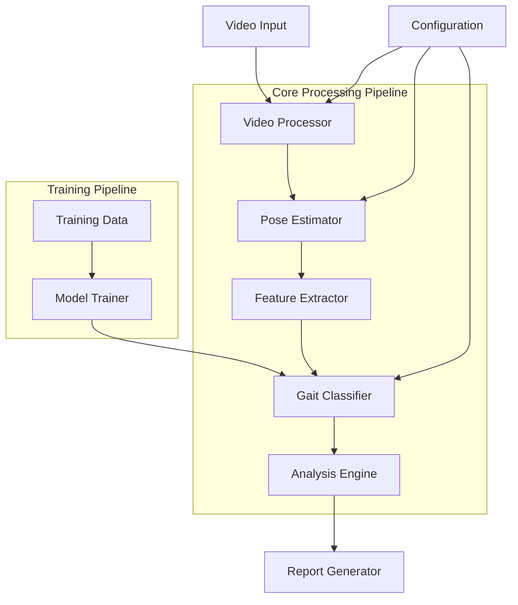

# Design Document: Gait Abnormality Detection System

## Overview

The Gait Abnormality Detection System is a deep learning-based application that analyzes video input to detect and classify gait abnormalities. The system combines modern pose estimation techniques with spatiotemporal deep learning models to provide comprehensive gait analysis for medical and research applications.

The system follows a modular architecture with distinct components for video processing, pose estimation, deep learning inference, and analysis reporting. It leverages state-of-the-art techniques including MediaPipe for pose estimation and 3D-CNN/Transformer hybrid architectures for spatiotemporal pattern recognition.

## Architecture



The system operates in two main modes:
1. **Training Mode**: Processes labeled datasets to train the gait classification model
2. **Inference Mode**: Analyzes new video inputs to detect and classify gait abnormalities

## Components and Interfaces

### Video Processor
**Purpose**: Handles video input validation, preprocessing, and frame extraction
**Key Functions**:
- Video format validation (MP4, AVI, MOV)
- Quality assessment (minimum 480p resolution)
- Duration validation (5 seconds to 2 minutes)
- Frame extraction at consistent intervals (30 FPS target)
- Video enhancement for low-quality inputs

**Interface**:
```python
class VideoProcessor:
    def validate_video(self, video_path: str) -> ValidationResult
    def extract_frames(self, video_path: str) -> List[np.ndarray]
    def enhance_quality(self, frames: List[np.ndarray]) -> List[np.ndarray]
```

### Pose Estimator
**Purpose**: Extracts human pose keypoints from video frames using MediaPipe
**Key Functions**:
- Real-time pose detection and tracking
- 33-point body landmark extraction
- Temporal consistency maintenance across frames
- Confidence scoring for each keypoint

**Interface**:
```python
class PoseEstimator:
    def extract_poses(self, frames: List[np.ndarray]) -> List[PoseSequence]
    def track_landmarks(self, pose_sequence: PoseSequence) -> TrackedPose
    def calculate_confidence(self, poses: List[TrackedPose]) -> float
```

### Feature Extractor
**Purpose**: Converts pose sequences into feature vectors suitable for deep learning
**Key Functions**:
- Spatiotemporal feature computation
- Gait cycle segmentation
- Normalization and standardization
- Augmentation for training data

**Interface**:
```python
class FeatureExtractor:
    def extract_spatiotemporal_features(self, poses: TrackedPose) -> np.ndarray
    def segment_gait_cycles(self, features: np.ndarray) -> List[GaitCycle]
    def normalize_features(self, features: np.ndarray) -> np.ndarray
```

### Gait Classifier
**Purpose**: Deep learning model for gait abnormality detection and classification
**Multi-Architecture Approach**: The system will implement and compare three different architectures:

1. **3D-CNN Architecture**
   - 3D Convolutional layers for spatiotemporal feature extraction
   - Batch normalization and dropout for regularization
   - Global average pooling and dense classification layers
   - Best for: Local spatiotemporal pattern recognition

2. **LSTM-based Architecture** 
   - Bidirectional LSTM layers for temporal sequence modeling
   - Attention mechanism for important frame selection
   - Dense layers for final classification
   - Best for: Long-term temporal dependencies and sequence patterns

3. **Hybrid CNN-LSTM Architecture**
   - 2D CNN for spatial feature extraction per frame
   - LSTM layers for temporal modeling of CNN features
   - Fusion layer combining spatial and temporal representations
   - Best for: Balanced spatial and temporal feature learning

**Model Selection**: Automated comparison based on validation performance, with the best-performing architecture selected for deployment

**Interface**:
```python
class GaitClassifier:
    def __init__(self, architecture_type: str):  # '3dcnn', 'lstm', 'hybrid'
        self.architecture_type = architecture_type
    
    def build_model(self, input_shape: Tuple[int, ...]) -> tf.keras.Model
    def train_model(self, train_data: Dataset, val_data: Dataset) -> TrainingHistory
    def predict(self, features: np.ndarray) -> ClassificationResult
    def predict_proba(self, features: np.ndarray) -> Dict[str, float]
    def evaluate_performance(self, test_data: Dataset) -> PerformanceMetrics
    def load_model(self, model_path: str) -> None
    def save_model(self, model_path: str) -> None
```

### Analysis Engine
**Purpose**: Processes classification results and generates comprehensive analysis
**Key Functions**:
- Gait parameter calculation (stride length, cadence, step width)
- Temporal analysis and asymmetry detection
- Correlation analysis between multiple abnormalities
- Clinical insight generation

**Interface**:
```python
class AnalysisEngine:
    def calculate_gait_parameters(self, poses: TrackedPose) -> GaitParameters
    def analyze_asymmetry(self, parameters: GaitParameters) -> AsymmetryMetrics
    def generate_insights(self, classification: ClassificationResult, 
                         parameters: GaitParameters) -> ClinicalInsights
```

### Memory Optimization Techniques

#### For Local RTX 4050 Training
- **Gradient Accumulation**: Simulate larger batch sizes with smaller memory footprint
- **Mixed Precision Training**: Use FP16 to reduce memory usage by ~50%
- **Model Checkpointing**: Save memory during backpropagation
- **Dynamic Batch Sizing**: Adjust batch size based on available memory
- **Data Loading Optimization**: Use efficient data pipelines to minimize GPU memory usage

#### Model Size Reduction
- **Knowledge Distillation**: Train smaller student models from larger teacher models
- **Pruning**: Remove unnecessary model parameters
- **Quantization**: Reduce model precision for inference
- **MobileNet Backbones**: Use efficient architectures designed for resource constraints

## Technology Stack and Data Sources

### Development Framework
- **Deep Learning**: TensorFlow 2.x / Keras for model development
- **Computer Vision**: OpenCV for video processing, MediaPipe for pose estimation
- **Data Processing**: NumPy, Pandas for data manipulation
- **Visualization**: Matplotlib, Seaborn for analysis charts
- **Testing**: pytest with Hypothesis for property-based testing
- **Environment**: Python 3.8+, Jupyter notebooks for experimentation

### Video Data Sources

#### Public Datasets (Readily Available)
1. **CASIA Gait Database**
   - Source: Chinese Academy of Sciences
   - Content: 124 subjects with normal and abnormal gaits
   - Access: Free for research use
   - URL: http://www.cbsr.ia.ac.cn/english/Gait%20Databases.asp

2. **OU-ISIR Gait Database**
   - Source: Osaka University
   - Content: Large-scale gait dataset with various conditions
   - Access: Registration required, free for academic use
   - URL: http://www.am.sanken.osaka-u.ac.jp/BiometricDB/GaitDB.html

3. **TUM-GAID Database**
   - Source: Technical University of Munich
   - Content: Audio-visual gait recognition dataset
   - Access: Free for research purposes
   - URL: https://www.mmk.ei.tum.de/tumgaid/

#### Synthetic Data Generation
- **Unity 3D Simulation**: Generate synthetic walking videos with controlled abnormalities
- **Blender Animation**: Create 3D human models with various gait patterns
- **Data Augmentation**: Apply transformations to existing datasets

#### Clinical Data Collection (Optional)
- **Collaboration with Medical Institutions**: Partner with hospitals/clinics
- **Ethical Approval**: IRB approval for human subject research
- **Privacy Compliance**: HIPAA-compliant data handling procedures

### Model Architecture Comparison Strategy

#### Evaluation Metrics
- **Accuracy**: Overall classification correctness
- **Precision/Recall**: Per-class performance analysis  
- **F1-Score**: Balanced performance measure
- **Training Time**: Computational efficiency
- **Inference Speed**: Real-time processing capability
- **Model Size**: Deployment feasibility

#### Architecture Specifications (Optimized for 6GB VRAM)

**1. Lightweight 3D-CNN Architecture**
```python
# Optimized for RTX 4050 (6GB VRAM)
# Input: (batch_size=2, frames=16, height=224, width=224, channels=3)
# Conv3D layers: 16, 32, 64 filters (reduced from 32, 64, 128)
# Kernel sizes: (3,3,3), (3,3,3), (3,3,3)
# MaxPooling3D: (2,2,2) after each conv block
# GlobalAveragePooling3D + Dense(128) + Dense(num_classes)
# Memory usage: ~4GB VRAM
```

**2. Efficient LSTM Architecture**  
```python
# Memory-optimized for local training
# Input: (batch_size=4, sequence_length=30, feature_dim=66)  # 33 keypoints * 2D
# Bidirectional LSTM: 64 units, 1 layer (reduced from 128, 2 layers)
# Attention mechanism: Lightweight self-attention
# Dense layers: 128, 64, num_classes
# Dropout: 0.3 between layers
# Memory usage: ~2GB VRAM
```

**3. Hybrid CNN-LSTM Architecture (Most Efficient)**
```python
# Best balance for RTX 4050
# CNN Feature Extractor: MobileNetV2 backbone (lightweight)
# TimeDistributed wrapper for sequence processing
# LSTM layers: 64 units, single direction
# Fusion: Concatenate CNN and LSTM features
# Classification head: Dense(64) + Dense(num_classes)
# Memory usage: ~3GB VRAM
```

### Hardware Requirements

#### Hybrid Free Cloud + Local Strategy (Optimized for Your Setup)

**Your Hardware Analysis:**
- **RTX 4050 Mobile (6GB VRAM)**: Excellent for inference, small-scale training, and experimentation
- **16GB RAM**: Perfect for data preprocessing and model development
- **i5-12450HX**: Strong CPU for video processing and pose estimation
- **100-200GB SSD**: Sufficient for datasets and model storage

#### Free Cloud Options (Priority Order)

**1. Kaggle Notebooks (Primary Recommendation)**
- **GPU**: Tesla T4 (16GB VRAM) - FREE
- **Limits**: 30 hours/week GPU time, 9 hours/session
- **Storage**: 20GB persistent, datasets up to 100GB
- **Advantages**: No credit card required, excellent for training
- **Best for**: Model training and comparison experiments

**2. Google Colab (Free Tier)**
- **GPU**: Tesla T4/K80 (variable) - FREE
- **Limits**: 12 hours/session, may disconnect during idle
- **Storage**: 15GB Google Drive integration
- **Advantages**: Easy setup, good for prototyping
- **Best for**: Initial development and testing

**3. AWS SageMaker Studio Lab**
- **GPU**: Tesla T4 - FREE
- **Limits**: 4 hours/session, 4 hours/24h period
- **Storage**: 15GB persistent
- **Advantages**: No credit card, professional environment
- **Best for**: Short training sessions and demos

**4. Paperspace Gradient (Free Tier)**
- **GPU**: M4000 (8GB VRAM) - FREE
- **Limits**: 6 hours idle shutdown
- **Storage**: 5GB persistent
- **Advantages**: Good for learning, stable environment
- **Best for**: Development and small experiments

#### Optimal Workflow Strategy

**Phase 1: Development & Prototyping (Local)**
- Video preprocessing and pose estimation
- Data exploration and visualization
- Model architecture development
- Small-scale testing with sample data

**Phase 2: Training (Free Cloud)**
- Use Kaggle for main model training (30h/week)
- Supplement with Colab for additional experiments
- Compare all three architectures (3D-CNN, LSTM, Hybrid)

**Phase 3: Inference & Demo (Local)**
- Deploy best model on your RTX 4050
- Real-time video analysis demonstration
- Final testing and validation

#### Resource Allocation Plan

**Local RTX 4050 Usage:**
- **Inference**: Excellent performance for real-time analysis
- **Small training**: Fine-tuning and transfer learning
- **Development**: Code development and debugging
- **Preprocessing**: Video processing and pose estimation

**Free Cloud Usage:**
- **Heavy training**: Full model training from scratch
- **Architecture comparison**: Test multiple models simultaneously
- **Large dataset processing**: Handle full datasets efficiently
- **Hyperparameter tuning**: Extensive experimentation

#### Cost: $0 (Completely Free Solution)

## Data Models

### Core Data Structures

```python
@dataclass
class PerformanceMetrics:
    accuracy: float
    precision: Dict[str, float]  # per-class precision
    recall: Dict[str, float]     # per-class recall
    f1_score: Dict[str, float]   # per-class F1
    training_time: float         # seconds
    inference_time: float        # seconds per sample
    model_size: float           # MB

@dataclass
class TrainingHistory:
    train_loss: List[float]
    val_loss: List[float]
    train_accuracy: List[float]
    val_accuracy: List[float]
    epochs: int
    best_epoch: int

@dataclass
class ModelComparison:
    architecture_name: str
    performance_metrics: PerformanceMetrics
    training_history: TrainingHistory
    model_path: str
    hyperparameters: Dict[str, Any]

@dataclass
class ValidationResult:
    is_valid: bool
    resolution: Tuple[int, int]
    duration: float
    format: str
    error_message: Optional[str]

@dataclass
class PoseKeypoint:
    x: float
    y: float
    z: float
    confidence: float

@dataclass
class PoseSequence:
    keypoints: List[List[PoseKeypoint]]  # [frame][keypoint]
    timestamps: List[float]
    confidence_scores: List[float]

@dataclass
class GaitParameters:
    stride_length: float
    cadence: float
    step_width: float
    swing_time: float
    stance_time: float
    double_support_time: float

@dataclass
class ClassificationResult:
    abnormality_type: str
    confidence: float
    severity_score: float
    affected_limbs: List[str]

@dataclass
class ClinicalInsights:
    primary_abnormalities: List[str]
    gait_parameters: GaitParameters
    asymmetry_metrics: Dict[str, float]
    recommendations: List[str]
    risk_factors: List[str]
```

### Model Training Data Structure

```python
@dataclass
class TrainingExample:
    video_path: str
    pose_sequence: PoseSequence
    ground_truth_label: str
    severity_score: float
    metadata: Dict[str, Any]

@dataclass
class Dataset:
    examples: List[TrainingExample]
    class_distribution: Dict[str, int]
    validation_split: float
```

## Correctness Properties

*A property is a characteristic or behavior that should hold true across all valid executions of a system—essentially, a formal statement about what the system should do. Properties serve as the bridge between human-readable specifications and machine-verifiable correctness guarantees.*

Let me analyze the acceptance criteria to determine which ones can be tested as properties:

### Property 1: Video Input Validation
*For any* video file input, the system should accept only MP4, AVI, or MOV formats with minimum 480p resolution and duration between 5 seconds and 2 minutes, returning specific error messages for invalid inputs
**Validates: Requirements 1.1, 1.2, 1.3, 1.4**

### Property 2: Frame Extraction Consistency  
*For any* valid video input, frame extraction should produce frames at consistent intervals
**Validates: Requirements 1.5**

### Property 3: Dataset Validation
*For any* training dataset provided, the system should validate format and labeling consistency before proceeding with training
**Validates: Requirements 2.1**

### Property 4: Training Completion Artifacts
*For any* successful training session, the system should produce both a saved model file and performance metrics
**Validates: Requirements 2.3**

### Property 5: Training Error Handling
*For any* training failure, the system should log detailed error information and preserve partial progress
**Validates: Requirements 2.4**

### Property 6: Gait Classification Output
*For any* processed video frames, the classifier should produce valid abnormality detection results with proper categorization
**Validates: Requirements 3.1, 3.2**

### Property 7: Confidence Flagging
*For any* classification result with low confidence, the system should flag uncertain predictions appropriately
**Validates: Requirements 3.3**

### Property 8: Normal Gait Recognition
*For any* video with no detected abnormalities, the system should confirm normal gait pattern
**Validates: Requirements 3.4**

### Property 9: Comprehensive Report Generation
*For any* completed analysis, the system should generate reports containing all required components: detected abnormalities, gait parameters (stride length, cadence, step width, swing time, stance phase), temporal analysis, asymmetry metrics, and clinical recommendations
**Validates: Requirements 4.1, 4.2, 4.4, 4.5**

### Property 10: Multi-Abnormality Correlation
*For any* analysis with multiple detected abnormalities, the system should provide correlation analysis and potential underlying causes
**Validates: Requirements 4.3**

### Property 11: Model Performance Validation
*For any* validation dataset, the system should test model performance against ground truth and report accuracy, precision, recall, and F1-scores
**Validates: Requirements 5.1, 5.2**

### Property 12: Performance Threshold Recommendations
*For any* model performance below acceptable thresholds, the system should recommend model retraining
**Validates: Requirements 5.3**

### Property 13: Validation Visualization
*For any* completed validation, the system should generate performance visualization charts
**Validates: Requirements 5.4**

### Property 14: Video Preprocessing Normalization
*For any* video data processed, the system should normalize frame dimensions and lighting conditions
**Validates: Requirements 6.1**

### Property 15: Data Augmentation Activation
*For any* training dataset below minimum size threshold, the system should apply appropriate data augmentation techniques
**Validates: Requirements 6.2**

### Property 16: Landmark Detection
*For any* feature extraction process, the system should identify and track key body landmarks successfully
**Validates: Requirements 6.3**

### Property 17: Preprocessing Error Messages
*For any* preprocessing failure, the system should provide specific error messages about data quality issues
**Validates: Requirements 6.4**

## Error Handling

The system implements comprehensive error handling across all components:

### Video Processing Errors
- **Invalid Format**: Clear message specifying supported formats (MP4, AVI, MOV)
- **Resolution Too Low**: Message indicating minimum 480p requirement with enhancement attempt
- **Duration Invalid**: Message specifying 5-second to 2-minute optimal range
- **Corrupted File**: Detailed error about file integrity issues

### Model Training Errors
- **Dataset Format Issues**: Specific validation errors with correction guidance
- **Training Convergence Failures**: Detailed logs with hyperparameter suggestions
- **Memory/Resource Constraints**: Clear resource requirement messages
- **Model Save Failures**: File system and permission error handling

### Classification Errors
- **Pose Detection Failures**: Fallback strategies and confidence reporting
- **Feature Extraction Issues**: Detailed error logs for debugging
- **Model Loading Errors**: Version compatibility and file integrity checks
- **Low Confidence Predictions**: Uncertainty quantification and user warnings

### Analysis Engine Errors
- **Parameter Calculation Failures**: Graceful degradation with partial results
- **Report Generation Issues**: Template and data validation errors
- **Correlation Analysis Failures**: Statistical computation error handling

## Testing Strategy

The system employs a dual testing approach combining unit tests and property-based tests for comprehensive coverage:

### Unit Testing
- **Specific Examples**: Test concrete scenarios with known inputs and expected outputs
- **Edge Cases**: Test boundary conditions, empty inputs, and error scenarios
- **Integration Points**: Test component interactions and data flow
- **Mock Testing**: Test individual components in isolation

### Property-Based Testing
- **Universal Properties**: Test properties that should hold across all valid inputs
- **Randomized Input Generation**: Generate diverse test cases automatically
- **Regression Detection**: Catch edge cases that manual testing might miss
- **Configuration**: Minimum 100 iterations per property test

**Testing Framework**: pytest with Hypothesis for property-based testing
**Test Organization**: Co-located with source files using `.test.py` suffix
**Coverage Target**: 90% code coverage with focus on critical paths

### Property Test Configuration
Each property test will be tagged with comments referencing the design document:
```python
# Feature: gait-abnormality-detection, Property 1: Video Input Validation
def test_video_validation_property():
    # Test implementation
```

### Test Data Management
- **Synthetic Data Generation**: Create test videos with known characteristics
- **Anonymized Clinical Data**: Use de-identified datasets for validation
- **Augmented Test Cases**: Generate edge cases through data augmentation
- **Performance Benchmarks**: Maintain baseline performance metrics

The testing strategy ensures both functional correctness through unit tests and universal property validation through property-based testing, providing confidence in system reliability across diverse real-world scenarios.